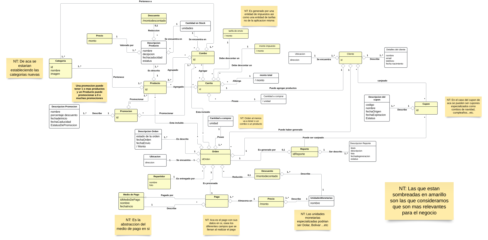

# Red-Team-Backend

This is the Red team backend for the subject Software Development into the ["Universidad Catolica Andres Bello"](https://www.ucab.edu.ve/)

## Developers
<table align="center">
    <tbody>
        <tr>
            <td align="center"><a href="https://github.com/bratik121" rel="nofollow"><br><sub><b>Bryant Mitchel</b></sub></a><br><a href="" title="Commits"><g-emoji class="g-emoji" alias="book" fallback-src="https://github.githubassets.com/images/icons/emoji/unicode/1f4d6.png">📖</g-emoji></a></td>
            <td align="center"><a href="https://github.com/RumbosE" rel="nofollow"><br><sub><b>Eduardo Rumbos</b></sub></a><br><a href="" title="Commits"><g-emoji class="g-emoji" alias="book" fallback-src="https://github.githubassets.com/images/icons/emoji/unicode/1f4d6.png">📖</g-emoji></a></td>
            <td align="center"><a href="https://github.com/C102002" rel="nofollow"><br><sub><b>Alfredo Fung</b></sub></a><br><a href="" title="Commits"><g-emoji class="g-emoji" alias="book" fallback-src="https://github.githubassets.com/images/icons/emoji/unicode/1f4d6.png">📖</g-emoji></a></td>
            <td align="center"><a href="https://github.com/ValsaniaUCAB" rel="nofollow"><br><sub><b>Alessandro Valsania</b></sub></a><br><a href="" title="Commits"><g-emoji class="g-emoji" alias="book" fallback-src="https://github.githubassets.com/images/icons/emoji/unicode/1f4d6.png">📖</g-emoji></a></td>
            <td align="center"><a href="https://github.com/Kaso105" rel="nofollow"><br><sub><b>Daniel Ponceleon</b></sub></a><br><a href="" title="Commits"><g-emoji class="g-emoji" alias="book" fallback-src="https://github.githubassets.com/images/icons/emoji/unicode/1f4d6.png">📖</g-emoji></a></td>
            <td align="center"><a href="https://github.com/Gabsousa2203" rel="nofollow"><br><sub><b>Gabriel De Sousa</b></sub></a><br><a href="" title="Commits"><g-emoji class="g-emoji" alias="book" fallback-src="https://github.githubassets.com/images/icons/emoji/unicode/1f4d6.png">📖</g-emoji></a></td>
        </tr>
    </tbody>
</table>

## Description

[Nest](https://github.com/nestjs/nest) framework TypeScript starter repository.

## Installation

```bash
$ pnpm install
```

## Running the app

```bash
# development
$ pnpm start

# watch mode
$ npm dev

# production mode
$ npm build
```

## Test

```bash
# unit tests
$ pnpm run test

# e2e tests
$ pnpm run test:e2e

# test coverage
$ pnpm run test:cov
```

## How to use it??

```bash
# execute the following command
$ docker compose up -d

# test coverage
$ pnpm run test:cov
```

## Support

Nest is an MIT-licensed open source project. It can grow thanks to the sponsors and support by the amazing backers. If you'd like to join them, please [read more here](https://docs.nestjs.com/support).

## Stay in touch

- Author - [Kamil Myśliwiec](https://kamilmysliwiec.com)
- Website - [https://nestjs.com](https://nestjs.com/)
- Twitter - [@nestframework](https://twitter.com/nestframework)

## License

Nest is [MIT licensed](LICENSE).

## Requirements
<p align="center">
<table align="center">
    <tbody>
        <tr>
            <td align="center"> <a href="https://docs.nestjs.com" rel="nofollow"> <br><sub><b>NestJS</b></sub></a><br><a href="https://docs.nestjs.com" title="Commits"><g-emoji class="g-emoji" alias="book" fallback-src="https://github.githubassets.com/images/icons/emoji/unicode/1f4d6.png">📖</g-emoji></a></td>
            <td align="center"> <a href="https://nodejs.org/docs/latest/api/" rel="nofollow"> <br><sub><b>NodeJS</b></sub></a><br><a href="https://docs.nestjs.com" title="Commits"><g-emoji class="g-emoji" alias="book" fallback-src="https://github.githubassets.com/images/icons/emoji/unicode/1f4d6.png">📖</g-emoji></a></td>
            <td align="center"> <a href="https://docs.docker.com" rel="nofollow"> <br><sub><b>Docker</b></sub></a><br><a href="https://docs.docker.com" title="Commits"><g-emoji class="g-emoji" alias="book" fallback-src="https://github.githubassets.com/images/icons/emoji/unicode/1f4d6.png">📖</g-emoji></a></td>
        </tr>
    </tbody>
</table>
</p>

## Inception (18-10-2024) 2 weeks

Make a Domain model following the principles of ["Third Edition Applying UML and Patterns An Introduction to Object-Oriented Analysis and design and iterative development (Craig Larman , 2016)"](https://www.amazon.ca/Applying-Uml-Patterns-Introduction-Development/dp/9332553947)
this is our domain model according to Elaboration and domain model chapter 3

[](https://lucid.app/lucidchart/6702d2bf-abc6-4e63-9c91-a2162adb8348/edit?beaconFlowId=F16D73A2C341A29D&invitationId=inv_e6b8aa9a-adee-4f9c-bda7-4b37490b17ca&page=0_0#)

## Elaboration (18-10-2024) 2 weeks

...On going